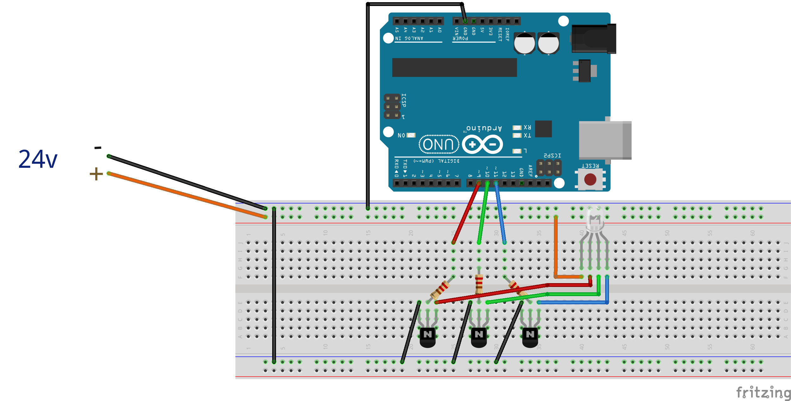

## Led Controller

Made to control a hacked IKEA Ledberg LED strip.

Uses three NPN transistors to control the color of the light strip via Pulse Width Modulation.

Originally made for IKEA Ledberg LED strip, but should work for any common cathode RGB led strip.

Below is the wiring diagram for Uno R3 board. Please note that this wiring requires a power source for the board as well. I would suggest wiring a 24v to 5v step-down converter from the LED power supply into the arduino board, so you can get away with one power source.

